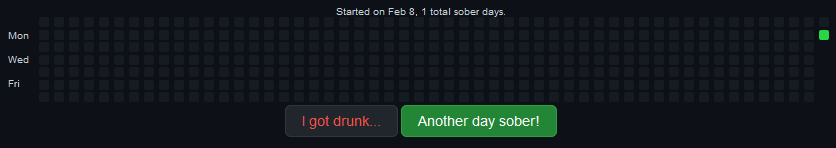

# 

We all need some time to ourselves.

##  For No One

This is a private way of expressing yourself: a chat in which you can write **whatever** you like.

The cool thing is: **no one is going to read it**, but yourself.

You can even change your No One's name and profile picture!

You can try it [here](https://garz4.github.io/venting/forNoOne).

##  Days Without Alcohol

Pretty straight forward. A GitHub-like calendar in which, every day, you can mark it as another day that you didn't have any alcohol!

**I drank alcohol,** on the other hand, will mark the current day as a non-sober day.

You can try it [here](https://garz4.github.io/venting/daysWithoutAlcohol).
