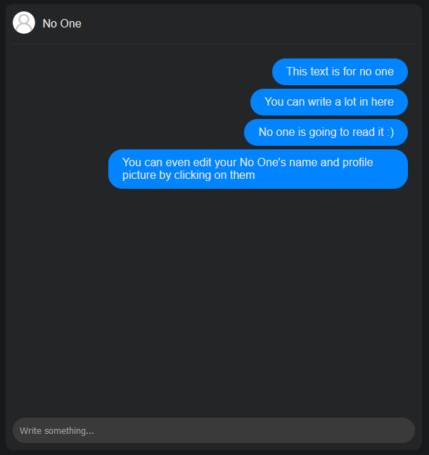

#  For No One

This is a private way of expressing yourself: a chat in which you can write **whatever** you like.

The cool thing is: **no one is going to read it**, but yourself.

You can even change your No One's name and profile picture!

You can try it [here](https://garz4.github.io/venting/forNoOne).
